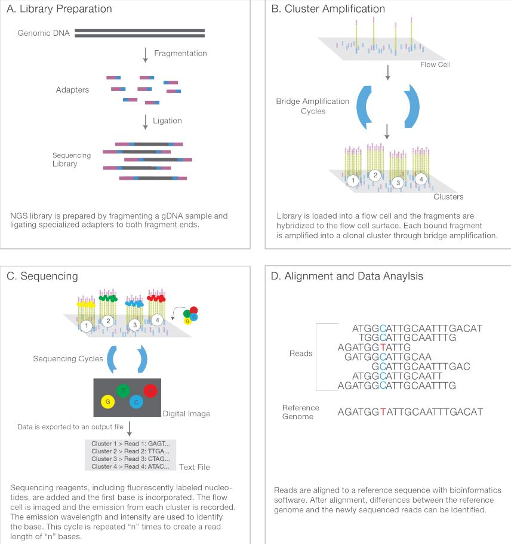
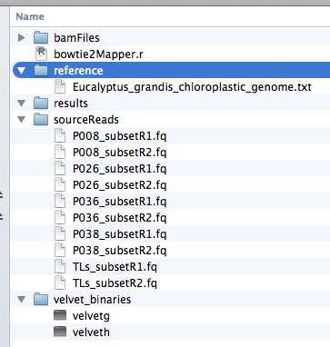
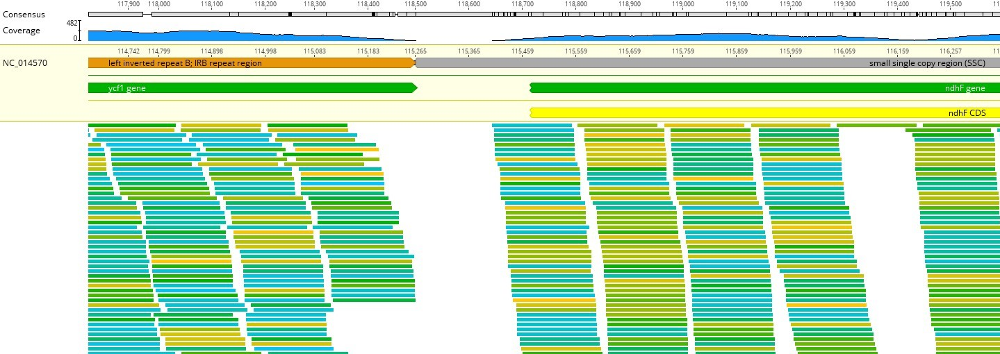
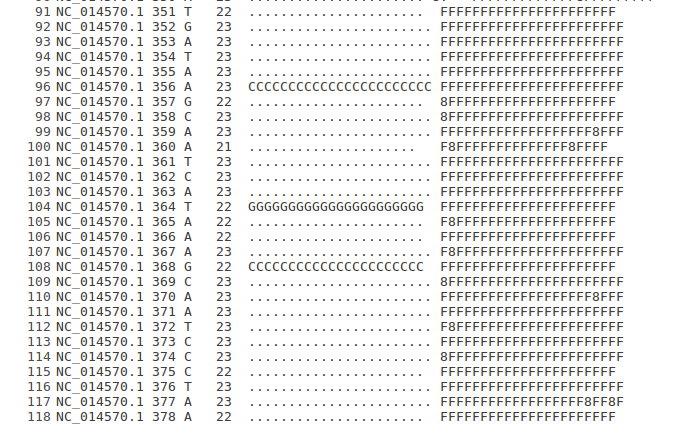
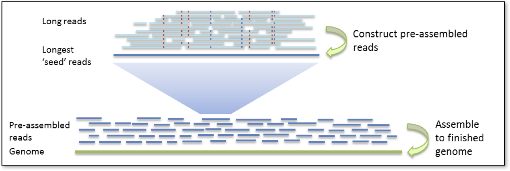

<!---pjbiggs.github.io--->


---

# Overview of the session

We are planning on covering the following in our 90 minute session:

* Some background on next generating sequencing
* What are we going to do?
    * What is a chloroplast?
    * How are going to do the practical?
        * Our computers
        * Our data source
        * Our environment
* Mapping of reads to a reference genome
    * Fasta format
    * Fastq format
        * Mapping quality
    * SAM/BAM files
    * Visualisation of mapping
        * Let's map some reads!
        * Getting an idea of the mapping as a whole
        * A simple analysis of some SNPs of interest
        * What's the overall picture looking like?
    * What did we learn from this mapping example?
* Assembly
    * Brief theory
    * Attempt with our reads
    * Analysis of the output
    * What did we learn?
* Session Summary

---

# Some background on next generating sequencing

We are going to look at how short sequence reads generated by Illumina technology can be mapped to a reference genome.  To start off with, let's have a look at this 4 minute video for a simplified NGS explanation from [George Mason Bioinformatics](https://www.youtube.com/watch?v=ToKUGz_YhC4).

So, to recap:



---

# What are we going to do?

Following on from this morning's work, we are going to look at how short sequence reads generated by Illumina technology can be mapped to a reference genome -- in this case a chloroplast genome from a related tree (*Eucalyptus grandis*) to manuka (*Leptospermum scoparium*) -- to look for SNPs that can maybe locate the samples to geographical locations.  As a reminder, here is an image of manuka:


This is from a page on the [T.E.R.R.A.I.N](http://www.terrain.net.nz/friends-of-te-henui-group/trees-native-botanical-names-g-to-l/manuka.html) website.


Your task is to try and find out information about the 5 samples to see where they come from. It could be from one of 5 locations:

* Northland
* East Cape
* Central North
* Australia
* South Island


## What is a chloroplast? 
 
Chloroplasts are cell organelles that are only found in plant cells. They utilise the light energy of the sun into sugars that can be used by the cell, a process known as photosynthesis. Chloroplasts have their own DNA, a double stranded circular molecule that is highly similar or conserved among plant species. (See below image obtained from [Ask A Biologist](https://askabiologist.asu.edu/chlorophyll-and-chloroplasts).


<!---In the dropbox David put in an image to show the distribution of Manuka and I think that needs to be put in here after “SNPs that can locate the samples to geographical locations”--->

We will go into this into certain aspects of this in a little more detail later, but the chloroplast we are looking at is ~160kb in length, and a genomic map of this chloroplast is shown below.


Clicking on the link [NC_014570](https://www.ncbi.nlm.nih.gov/nuccore/NC_014570) will take you to the entry at NCBI which you can have a look at if you would like to (not compulsory or required). 

We have our reference genome, and also our short reads that have been previously generated for us.  We are going to do two things with: map these reads to the reference and assemble the short reads into longer sequence contigs.

---

## How are going to do the practical?

We are going to use Apple iMacs and a set of data that we can download from a resource to work with.  If you have not used an iMac before, the "command line", or a piece of software called [RStudio](https://www.rstudio.com/), then we have a few preliminaries to go through.

### Our computers

Let's start off with RStudio.  Depending on the setup, you may either have an RStudio icon on your machine, or you will have to go start the software.  

<p align="center"/>

For us in this short practical, we have an icon on the application bar at the base of the screen.  It's the blue circle with "R" in white writing inside it.  On the icon, just double click on it.  If you want to start one another way, click on the search magnifier icon in the top right of the screen, and type "RStudio".  Either way, the result is a session of the program RStudio opening after a few seconds. RStudio is a nice glossy way to use a statistical language called R.  

[R](https://www.r-project.org/) is derived from a statistical language called S, that was developed by Ross Ihaka (of Ngati Kahungunu, Rangitane and Ngati Pakeha descent) & Robert Gentlemen (statisticians at the University of Auckland) who wanted to make a basic version of S for teaching purposes. Oh, and R - "comes before S" - from 2 guys whose first initial is R!!

**NB: We do not unfortunately have the time to go too much into the background theory on what we are doing here, we are doing 90 minutes of an overview that would take hours of a University course to teach in far more detail.**


### Our data source

On the desktop you will see a folder called "bioinformatics":


We will work with a folder from within the "bioinformatics" folder.  You should see the "bioinformatics" folder on your desktop.  Double click on it and go to the "SING-Aotearoa2019" folder (there are lots of folders in the "bioinformatics folder" from other courses that are run using these computers).  Click on the folder once and then, copy the folder to your Desktop before you do anything else (this could take a fe wminutes).  We will work with the contents of this folder.

So, what do we have in this folder to work with?  A screenshot of the folder is below:



We have a file called "bowtie2mapper.r", and then 3 folders of interest right now called:

* sourceReads - where the reads we are going to work with live
* results - where we will place our results
* reference - where our chloroplast reference lives


### Our environment

So let's look at RStudio in a little more detail.  Again, this is a brief introduction to give you a flavour.  On opening RStudio, you should see four windows, of which we are mostly worried about the two on the left hand side, the two on the right hand side not so much.  


Think of the top window -- the source -- as where we ask the software to do things for us, and the bottom window -- the console -- as where it happens and we see the results.  In other words, we are going to copy and paste text into the top left window, and we see results in the bottom left window.  For today, that is all you need to know.  

We are dealing with lots of new concepts simultaneously here, and we are trying to make this understandable, rather than  "ahh, it's all new and too complicated".  Therefore, we are keeping to only a single piece of software today rather than many, but trust me, we can do a lot here, and there is alot going on behind the scenes.

For the sake of time, we are also copying and pasting from the text in the style below into the source window (in a more detailed course there would be typing of these commands).  It's in a different font:

`library(ggplot2)`

or it might be in a box that looks like this:

```
library(ggplot2)
```

Either way, this is the code we want to use.  Your top left -- source -- window should be empty.  If we copy this text into the source window, highlight the line it is on and hit the run button, we see a response in the console below.  Let's give it a try with this line of code....


Ok, you should see something like the following in the console (number 6), if not please raise your hand to get some help.  What we have done here is not so important (we have loaded a pre-packed piece of R software called a library that does a great many things for us) as the fact you have run a command in RStudio and it did something.  Well done!  We are going to be doing more of this soon...

---

# Mapping of reads to a reference genome

## Fasta format

This is a simple file that is at the base of modern moleclar biology and genetic analysis.  History and more information can be found [here](https://en.wikipedia.org/wiki/FASTA_format).  The file format has two lines per sequence, the first header line is the header where we name the sequence, and the second is the sequence itself, in other words:  

```
read header (starts with '>')
sequence
```
So an example would be:

```
>sequence1
AGCTAGTAGCGAGCAGCTAGCTATATAGC
```
We can extend this idea so that a single file can have multiple sequences:

```
>sequence1
AGCTAGTAGCGAGCAGCTAGCTATATAGC
>sequence2 anything after a space is ignored
AGCCGCGAAACGACGAGAGCTCTCGCAGAGAGATCTCGCGATATATAGCGCGCGCGGGGGCGG
```

Sequences can go over multiple lines, or one very long line, and there can be thousands or millions of sequences in a fasta file.  We are going to make such a file later on with the assembly part of the practical. 


## Fastq format

THe new sequencing machines from the last decade or so provide us more information than the older -- Sanger -- sequncing ones did.  We now a have new sequence format called fastq that gives us much more information, that extra information being the quality of the sequences generated.  A brief overview of the format can be found at the [FASTQ_format](https://en.wikipedia.org/wiki/FASTQ_format) wiki page. Please have a look at this file to familiarise yourself with the fact that each sequence covers 4 lines of text, and has much more information in it than a standard fasta file:

```
read header (usually starts with '@')
sequence
extra line (now usually a "+") for space reasons
quality (encoded as a single character defined by an equation)
```

So, here is a single sequence:

```
@HWI-EAS209_0011_FC62A33:6:34:4163:11178/1
ACTAGCTTGTCACCAATGGTGCACTCTCATTGGCAAGTGGAACTACATTAAACGGGCAAACCATCGTTAC
+
hhhheghh_hhhghhhfegddafefghhghhhhghhhdhhdadcdggahedf[cdfgfeffcfcddaadd
```

The header line -- starting with '@' -- is complicated in terms of the information it provides, but useful nonetheless.  As you may now see, these files can be truly huge in size, and a typical output may have millions of sequences in a single file.  Luckily the software knows how to interpret these files correctly!

### Sequence quality

For the purposes of today, we want to encode a quality value called *Q* -- **how confident we are that the base is called as being incorrect** -- as a probability *p*. We want lots of certainty, so therefore very little uncertainty. 

The value of *Q* is also called a Phred value.  As you may imagine this is an issue as a value of *p* will have more than 1 character as it is small, but it refers to a single base, be that A, C, G or T.  Therefore, how do we do this?  Well, we use an equation to relate *p* to *Q* thus:


Many pieces of software are able to automatically determine the encoding system used (yes, there is more than one, sigh), so they can convert easily between the two depending on the need.  This has implications for the mapping of short reads to a reference genome using mapping software such as [Bowtie2](http://bowtie-bio.sourceforge.net/bowtie2/index.shtml) or [BWA](http://bio-bwa.sourceforge.net/), but first we have to look at our main file type for mapping, an "industry standard" if you like.

However this idea that we can have a way to look at the quality of a single base in a sea of millions or even billions is very imporant, especially if we are looking for variation in the DNA from a sample that might have implications about its origin for example.  In other words, we want to have confidence in our data and define it numerically.

## SAM/BAM files

We have met two filetypes so far -- fasta and fastq -- and now it is time for the third and fourth type.  It is really only one type, called a SAM file, as the other type called a BAM file is a compressed, indexed binary version of a SAM file.  Again, we are looking at very large files here, so hard disk space is an issue, and compressing files is a good thing.

What does a SAM file look like?  SAM stands for **S**sequence **A**lignment **M**ap and is a text format for storing sequence data in a series of tab delimited  columns.  some basic information can be found at this [SAM information](https://genome.sph.umich.edu/wiki/SAM) page.  As this is a very important file type it has [official specifications](http://samtools.github.io/hts-specs/SAMv1.pdf) that is 20 pages long and quite detailed.

The file has two sections: a header and an alignment section.  20 pages in the specification means lots of information, but again for the purposes of today, this file provides a way to define how sequence reads map to a reference genome.

### The header section

The following is an example from one of the files you will shortly generate:

> @HD	VN:1.0	SO:unsorted
>
> @SQ	SN:NC_014570.1	LN:160137
>
> @PG	ID:bowtie2	PN:bowtie2	VN:2.2.6	CL:"/usr/bin/bowtie2-align-s --wrapper basic-0 --threads 4 --end-to-end -x /home/pbiggs/extraDrive2/data/ManukaSING/reference/EuGrandisChl -S /home/pbiggs/extraDrive2/data/ManukaSING/results/resultsP026.sam -1 /home/pbiggs/extraDrive2/data/ManukaSING/workingReads/P026_subsetR1.fq -2 /home/pbiggs/extraDrive2/data/ManukaSING/workingReads/P026_subsetR2.fq"

Amongst other things, Ii contains information about the reference genome (name and length), as well as how it was generated, i.e. the code that was run.

### The alignment section

This file contains the information within a fastq file, as well as the mapping results.  Hopefully you can see how SAM files can get large quickly, and why the need to be compressed to save space.  

Each row has 11 columns with information about how the mapping went.  Sorry to say there is not time to go into this in detail, if you are interested, please look at the specifications listed above.

## Visualisation of mapping

### Let's map some reads!

The first thing we have to do is map our reads to the reference chloroplast.  From this morning, you have worked in pairs, and we will keep those pairs for this afternoon's practical.  You have been allocated a set of sequencing reads from a sample at random as per the table below:

| pair | name   | sample    | pair  |   name | sample    |
|------|:------:|:---------:|-------|:------:|:---------:|
| tahi |        | P008      | ono   |        | P026      |
| rua  |        | TLs       | whitu |        | P036      |
| toru |        | P026      | waru  |        | P008      |
| wha  |        | P038      | iwa   |        | P038      |
| rima |        | P036      | tekau |        | TLs       |

<!---made using https://www.tablesgenerator.com/markdown_tables# --->

Let's start using RStudio to do some investigation on these sequencing reads.  In the folder you will find a file called `bowtie2mapper.r`.  We are going to open and use this file in RStudio to map your allocated reads to the reference. Open the file by performing the following in RStudio:

`File > Open file > /Desktop/SING-Aotearoa2019/bowtie2mapper.r`

In your source window -- in lots of colour -- the code should look like the below.  **lines that start with a `#` are comments and the sofware does nothing with them, they are there for primarily for your information.**  

```
### SING-Aotearoa 2019 Bioinformatics practical ###

## mapping reads to a reference ##

# our reference genome  

refSeq <- 
as.name("/Users/bioinformatics/Desktop/SING-Aotearoa2019/reference/Eucalyptus_grandis_chloroplastic_genome.txt")
refIn <- 
as.name("/Users/bioinformatics/Desktop/SING-Aotearoa2019/reference/EuGrandisChl")

## variables for doing the work ##
#
# in the next 9 lines, you have to change the 'XXXX' to your allocated sample
# if you do not do this, this will not work
#
#####

read1 <- as.name("/Users/bioinformatics/Desktop/SING-Aotearoa2019/sourceReads/XXXX_subsetR1.fq")
read2 <- as.name("/Users/bioinformatics/Desktop/SING-Aotearoa2019/sourceReads/XXXX_subsetR2.fq")
Sam <- as.name("/Users/bioinformatics/Desktop/SING-Aotearoa2019/results/resultsXXXX.sam");
Bam <- as.name("/Users/bioinformatics/Desktop/SING-Aotearoa2019/results/resultsXXXX.bam");
BamSort	<- 
as.name("/Users/bioinformatics/Desktop/SING-Aotearoa2019/results/resultsXXXX_Sorted");
BamSort1 <- 
as.name("/Users/bioinformatics/Desktop/SING-Aotearoa2019/results/resultsXXXX_Sorted.bam");
BamSort1In <- 
as.name("/Users/bioinformatics/Desktop/SING-Aotearoa2019/results/resultsXXXX_Sorted.bam.bai");
inPileUp <- as.name("/Users/bioinformatics/Desktop/SING-Aotearoa2019/results/pileupXXXX.txt");
inPileUpSmall <- 
as.name("/Users/bioinformatics/Desktop/SING-Aotearoa2019/results/pileupXXXX_small.txt");


## run a bowtie build on the reference ##

system(paste("/Users/bioinformatics/Applications/bowtie2/bowtie2-build ", refSeq, refIn))
system(paste("/Users/bioinformatics/Applications/samtools/samtools faidx", refSeq))


## let's do the mapping ##

system(paste("/Users/bioinformatics/Applications/bowtie2/bowtie2 --end-to-end -x ", refIn, " -1 ", read1, 
" -2 ", read2, " -S ", Sam))
system(paste("/Users/bioinformatics/Applications/samtools/samtools view -bS ", Sam, " > ", Bam))
system(paste("/Users/bioinformatics/Applications/samtools/samtools sort ", Bam, BamSort))
system(paste("/Users/bioinformatics/Applications/samtools/samtools index ", BamSort1))
system(paste("/Users/bioinformatics/Applications/samtools/samtools mpileup -B -d 1000 -f", 
refSeq, BamSort1, ">", inPileUp))


## all complete for now
```

There's lots here, which is why you have this as a file, it will take too long to copy and paste.  

But wait, it's not that easy.  We have left out the most important bit, and that is that you have to edit the code to work on your samples.  As written the code will not work!  In lines 15 to 23, there are 9 lines of code to edit:

1. Simply replace the value "XXXX" with the value in the 'sample' in the table above.
2. Save the resulting R file with a different name.
3. As described above, run the code line by line. Allow time for things to happen (some are quick, some not so).

Ok, looking at the code, what does it say?  You can ignore the next bit if you want:

> Define all our variables
>
> Make the correct file from the reference for bowtie2 to use
>
> Make an index of that file (useful for later)
>
> Map your reads to the reference to make a SAM file
>
> Convert this to a BAM file, sort it and index it
>
> Run a separate command to generate a further text output file 

Please do not worry too much about the detail, if you can edit the code and get a resulting mapping file that is great, as we can then go on to the next part.  We can discuss further if required.


### Getting an idea of the mapping as a whole 

Can we look at some overall summaries of the way the mapping has worked?  Please remember that we are looking at 160,137bp of sequence here in our reference genome, which is actually quite small (the human genome is ~18,700 x the size of this chloroplast).

We have to load some of R packages to allow the software to perform certain functions for us, on our sequence object -- the Bam file we just created called `BamSort1`.  Let's just check it out to see how well our reads mapped to it:

```
# we shall load a couple of libraries

library("Rsamtools")
library("GenomicAlignments")

# we shall change our variable names
#
# remember again to replace the "XXXX" with your sample name

Bam <- ("/Users/bioinformatics/Desktop/SING-Aotearoa2019/results/resultsXXXX.bam");
BamSort	<- ("/Users/bioinformatics/Desktop/SING-Aotearoa2019/results/resultsXXXX_Sorted");
BamSort1 <- ("/Users/bioinformatics/Desktop/SING-Aotearoa2019/results/resultsXXXX_Sorted.bam");
BamSort1In <- ("/Users/bioinformatics/Desktop/SING-Aotearoa2019/results/resultsXXXX_Sorted.bam.bai");

# we shall perform a quick summary analysis on our mapped Bam file

idxstatsBam(BamSort1, index=BamSort1)
```

Once again, you wil have to change the "XXXX" to your sample name.  We can see now that we have 250,000 reads that have mapped to the reference NC_014570, and there are 0 reads unmapped.  Is that what you see for your sample?

What else can we do?  A great deal, but again we are short on time.  However ome thing we can do is have a look at the way the reads have mapped to the reference, first by text, and then graphically.  

```
# read in the sequence alignments

x <- readGAlignments(BamSort1)

# calculate the coverage values and print the output to screen

xcov <- coverage(x)
xcov
```

We miss out lots of information here when it is printed to the console like this.  Can we look at it graphically?  Yes we can:

```
# capture the range of our reference

z <- GRanges("NC_014570.1",IRanges(1,160137))

# subset the coverage of the region of interest, convert it and print out an image

xcov[z] 
xnum <- as.numeric(xcov$NC_014570.1[ranges(z)])
plot(xnum, col = 'red', lwd=0.1, main = "coverage of chloroplast", xlab = "position (bp)", 
ylab = "sequencing depth")
```

This result might take a few seconds to generate the figure, and has all the sequencing depth information for the mapping.  There is not really ever uniform across the reference for a variety of reasons.  This is to much data to look at, so let's just pick a random distance of say 10,000 bp in the reference (between 1 and 160,137), and see what the sequencing depth is.  Tty again, with a random start and end point in the below.  You have to enter values, and remember to keep the comma there too:

```
z <- GRanges("NC_014570.1",IRanges(--start--,--end--))

# subset the coverage of the region of interest, convert it and print out an image

xcov[z] 
xnum <- as.numeric(xcov$NC_014570.1[ranges(z)])
plot(xnum, col = 'blue', lwd=0.1, main = "coverage of a random section of the chloroplast", 
xlab = "position (bp)", ylab = "sequencing depth")
```

Your random section might show all kinds of things in detail, depending on your sample and the region. Give it a go a couple of times if you like, but remeber to rerun the complete code block above, from setting new values for "z".

If you had a gene of interest, you might want to look at that too.  Let's do that right now, and in fact this is a gene where some of the SNPs we are going to look at shortly can be found.  This is the *atpA* gene:

```
z <- GRanges("NC_014570.1",IRanges(11193,12716))

# subset the coverage of the region of interest, convert it and print out an image

xcov[z] 
xnum <- as.numeric(xcov$NC_014570.1[ranges(z)])
plot(xnum, col = 'steelblue', lwd=1, main = "coverage of the atpA gene on the chloroplast", 
xlab = "position (bp)", ylab = "sequencing depth")
```

From these three plots, you can see that we have ~300 fold sequencing depth, this means that on average any position in our chloroplast have many (say around 300) individuals reads that map to the region where that position is.  As you can see though, it is not that simple.

### A simple analysis of some SNPs of interest

This is the heart of what we are doing in the session, looking at individual regions of the chloroplast at really high resolution.  

We have 10 SNPs, of which 3 have been amplified this morning.  We shall have a look at some of them now.  We know the location of the SNPs, so how do we analyse the region?  

Now we are going to look at 5 regions of the chloroplast genome where we know there are SNPs that help us locate our samples. Please be aware there are many other SNPs beyond these 5 we are interested in that might also be interesting in a fuller analysis.  **Because mapping causes slight variations in the way the bases are mapped by changing the coordinates, we have to look at a region and then the sequence within that.**  

The following table shows 5 regions for us to look at.  Again, using these regions in the code below, as well as the supplied DNA sequence, please make a note of the DNA base that is the 4th one after the sequence supplied in the table below, as that is our DNA base of interest:

| Marker name | Primer sequence    |  Specificity  | Allele targeted | Reference | start | end   |
|-------------|--------------------|:-------------:|:---------------:|:---------:|-------|-------|
| cpMan_11745 | TAAGCCGAAACATC     |   Northland   |        T        |     C     | 11700 | 11799 |
| cpMan_12781 | CCTACAATAGAAGGACTA |   East Cape   |        C        |     A     | 12750 | 12849 |
| cpMan_18043 | GAATGTTCTTATGTTGC  | Central North |        A        |     G     | 18000 | 18099 |
| cpMan_35755 | AGAGGGGGCCGTGTACG  |   Australian  |        C        |     A     | 35700 | 35799 |
| cpMan_44986 | CGAGCACCATGGAAATA  |  South Island |        G        |     G     | 44950 | 45049 |

If your sample is from the geographic location you should see the DNA base in the column "Allele targeted" above. Unfortunately this is not absolute, but it gives you an idea.  We shall discuss this in a while, as this is a small exmaple to illustrate the principles of how this process can work.

How do we do this by code?  Let's use and run the following:

```
# these first two lines set the number of rows of data at the start and end of the output
# these values can easily be changed if you need to
# the last line does the work, and analyses the data over the region we have asked for

options(showHeadLines=150)
options(showTailLines=50)
stackStringsFromBam(BamSort1, param=GRanges("NC_014570.1",IRanges(--start--,--end--)))
```

Please replace the "--start--" and "--end--" with the values in the table below, and then run your code.  **Keeping the comma in between them is important, so please make sure it is there, otherwise it will not work.**  This will print out the alignment for 100 bp in your region of interest to the console.  Try to find the sequence from the table, and then the 4th base after it.  Please make a note of it.

People tend to think and draw a genome as a horizontal line.  Our reads that have mapped have therefore mapped in the horizontal plane. So for example:



Here a sequencing read starts and ends at a point, not quite at random, but nearly. The depth is then looked at in a vertical line for a given base in the reference.  

If you go back to the SING-Aotearoa folder on your desktop, as part of the code run you made a file called "pileupXXXX.txt" where XXXX is your sample name.  This is a big file, so we are going to make a smaller version, of say the first 5000 positions before we look inside it:

```
system(paste("head -n 5000" inPileUp, ">", inPileUpSmall))
```

We defined the names of these files at the start of this part of the practical. Click on the file "pileupXXXX_small.txt" and then right click to open with a text editor called TextWrangler.  If you scroll up and down the file, you should see something like the below:

<p align="center"/>

wWat we have done here is in effect rotated our sequencing results through 90 degrees.  In this file however, we have now made each position a line in the file and the information about that position all on one line.  We thus have a 6 column output:

1. Our reference genome - NC_014570.1	
2. Each base pair is a line - for example 356	
3. The reference base at that position - in this case A	
4. The number of times this base has been sequenced - in this case 23
5. The sequence observed from our sample	- in this case CCCCCCCCCCCCCCCCCCCCCCC	
6. The quality of the mapped bases - in this case FFFFFFFFFFFFFFFFFFFFFFF

On scrolling any sequences in the 5th column indicate varation against the reference, and there is a fair amount. **Please remember that we have mapped our sample reads to a related species, not to manuka itself, so the inherent variation of not comparing like to like is evident.**  There are other kinds of variation visible, but we might have to leave those for now in the interests of time.


### What did we learn from this mapping example?

Ok, so we will stop at this point and discuss our results from the whole group.  Questions to discuss include:

* Can we locate our samples based on the information?
* Do we have good evidence to support that?
* Was this a useful exercise?

Now, we will finish off the practical with something completely different.

---

# Assembling a small genome 

## Brief theory

The assembly of a genome is the process whereby the fragmented small DNA pieces that you have created in the lab that have subsequently been sequenced are reassembled by looking for regions of overlap. These reads must be reassembled in the correct order to visualise the genome correctly, this is carried out simply by taking both ends of each DNA fragment and comparing its code to every other DNA fragment, if the code matches they are said to overlap and they therefore lie side by side in the genome. This is carried out until all of the reads are compared and all of the overlapping fragments obtained. 

These overlapping fragments can then be joined together to create a contiguous sequence or “contig”. As sequencing technologies are not yet perfect, some data will be missing and therefore we do not end up with just one long complete genome contig.  We instead end up with multiple contigs. Additional technology is then used to take these multiple contigs, again find overlaps between contigs to make longer sequences called scaffolds.  Diagrammatically, [this looks like](https://pb-falcon.readthedocs.io/en/latest/about.html):




## Attempt with these reads 

We are going to use a now slightly old piece of software called [Velvet](https://www.ebi.ac.uk/~zerbino/velvet/), but it is still very useful.  Once again we will go back to RStudio to run some more code from there:

```
XXXXXXX

Velvet code in here.....

XXXXXXX
```

## Analysis of the output

There is a great website called [QUAST](http://quast.bioinf.spbau.ru/) where we can upload contigs from assemblies to have a look at them, rather than having to download software.  We shall use this website now.  

```
XXXXXXX

upload contigs to QUAST

XXXXXXX
```


## What did we learn?


---

# Session Summary

We have come to the end of our session.  We hope this has been a brief useful introduction to a couple of aspects of introductory bioinformatics, and a good logical progression to the lab work this morning.  We have seen that there is a tip to the iceberg, and that is about it that we have in the time we have available.  Obviously we could discuss this for a lot longer, as we could all aspects of the course this week.

We have performed "dry lab" science this afternoon, having done "wet lab" science this morning.  Data is now a part of our lives, and the sequencing revolution in the biological sciences has changed what we do, and the questions we can ask, as well as the larger issues of relevance to the whole of this course.
