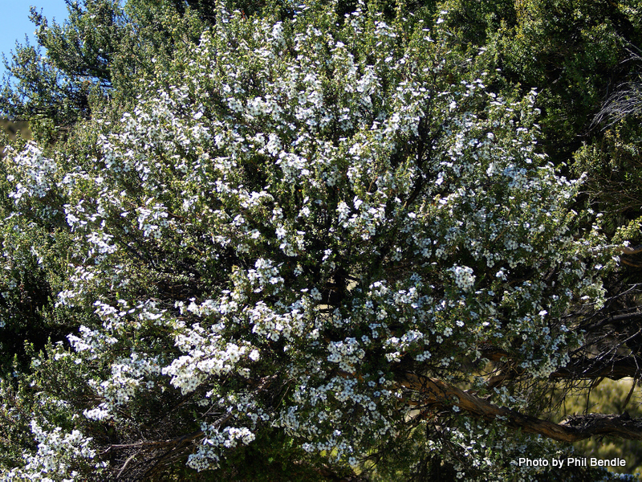
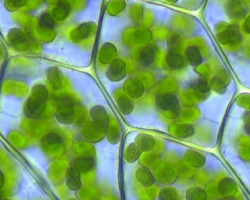
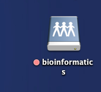
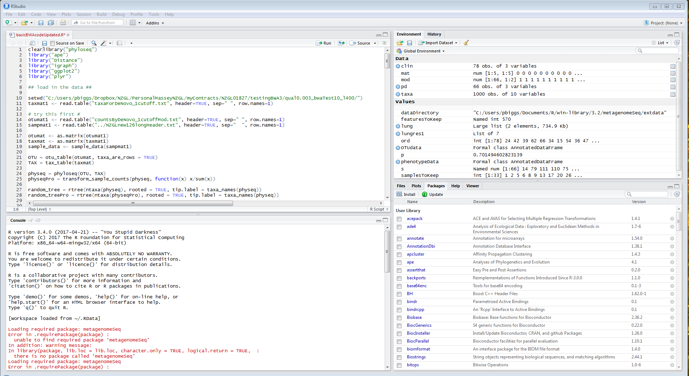
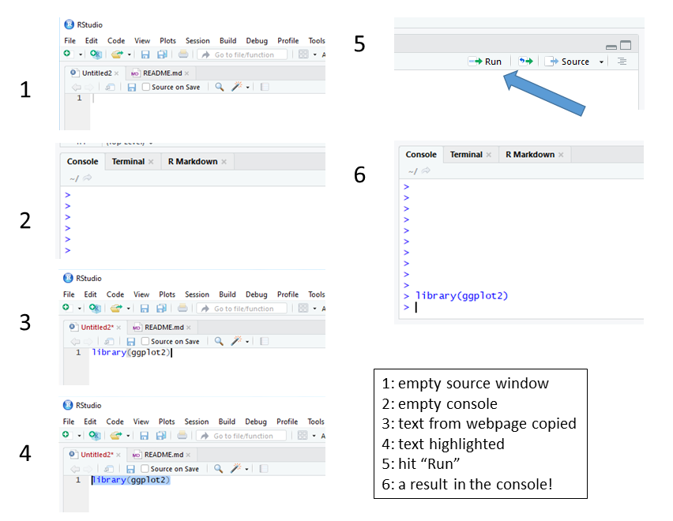
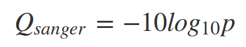

<!---pjbiggs.github.io--->

This is taking place on Wednesday 23rd January 2019 at 1330 -- 1500 in C5-10, Science Tower C, Massey University, Palmerston North.

By:- Patrick J Biggs and Ann McCartney


# Some background on next generating sequencing


# What are we going to do?

Following on from this morning's work, we are going to look at how short sequence reads generated by Illumina technology can be mapped to a reference genome -- in this case a chloroplast genome from a related tree (*Eucalyptus grandis*) to Manuka (*Leptospermum scoparium*) -- to look for SNPs that can locate the samples to geographical locations.  As a reminder, here is an image of manuka:



This is from a page on the [T.E.R.R.A.I.N](http://www.terrain.net.nz/friends-of-te-henui-group/trees-native-botanical-names-g-to-l/manuka.html) wbesite.


Your task is to try and find out information about the 5 samples to see where they come from. 

## What is a chloroplast? 
 
Chloroplasts are cell organelles that are only found in plant cells. They utilise the light energy of the sun into sugars that can be used by the cell, a process known as photosynthesis. Chloroplasts have their own DNA, a double stranded circular molecule that is highly similar or conserved among plant species. (See below image obtained from [Ask A Biologist](https://askabiologist.asu.edu/chlorophyll-and-chloroplasts).




```

In the dropbox David put in an image to show the distribution of Manuka and I think that needs to be put in here after “SNPs that can locate the samples to geographical locations”

```


We will go into this into certain aspects of this in a little more detail later, but the chloroplast we are looking at is ~160kb in length, and a genomic map of this chloroplast is shown below.


Clicking on the link [NC_014570](https://www.ncbi.nlm.nih.gov/nuccore/NC_014570) will take you to the entry at NCBI which you can have a look at if you would like to (not compulsory or required). 

We have our reference genome, and also our short reads that we are going to do two things with: map these to the reference and assemble the short reads into longer sequence contigs.

---

# How are going to do it?

We are going to use Apple iMacs and a set of data that we can download from a resource to work with.  If you have not used an iMac before, the "command line", or a piece of software called [RStudio](https://www.rstudio.com/), then we have a few preliminaries to go through.

## Our computers

Let's start off with RStudio.  Depending on the setup, you may either have an RStudio icon on your machine, or you will have to go start one.  

<p align="center"/>

For us in this short practical, we have an icon on the application bar at the base of the screen.  It's the blue circle with "R" in white writing inside it.  On the icon, just double click on it.  If you want to start one another way, click on the search magnifier icon in the top right of the screen, and type "RStudio".  Either way, the result is a session of the program RStudio opening after a few seconds. RStudio is a nice glossy way to use a statistical language called R.  

[R](https://www.r-project.org/) is derived from a statistical language called S, that was developed by Ross Ihaka (of Ngati Kahungunu, Rangitane and Ngati Pakeha descent) & Robert Gentlemen (statisticians at the University of Auckland) who wanted to make a basic version of S for teaching purposes. Oh, and R - "comes before S" - from 2 guys whose first initial is R!!

**NB: We do not unfortunately have the time to go too much into the background theory on what we are doing here, we are doing 90 minutes of an overview that would take hours of a University course to teach in far more detail.**


## Our data source

On the desktop you will see a folder called "bioinformatics":



We will work with a couple of test folders from the "bioinformatics" folder.  You should see the "bioinformatics" folder on your desktop.  Double click on it and go to the "SING-Aotearoa2019" folder (there are lots of folders in the "bioinformatics folder" from other courses that are run using these computers).  Click on the folder once and then, copy the folder to your Desktop before you do anything else.  We will work with the contents of this folder.

So, what do we have in this folder to work with?  

XXXXXXXXXXX more needed here XXXXXXXXXXX

## Our environment

So let's look at RStudio in a little more detail.  Again, this is a brief introduction to give you a flavour.  On opening RStudio, you should see four windows, of which we are mostly worried about the two on the left hand side, the two on the right hand side not so much.  



Think of the top window -- the source -- as where we ask the software to do things for us, and the bottom window -- the console -- as  where it happens.  For today, that is all you need to know.  We are doing something here to try to stop this from being "ahh, it's all new", so we are keeping to only this single tool, but trust me, we can do a lot here, and there is alot going on behind the scenes.

For the sake of time, we are also doing copying and pasting from the text in the style below into the source window.  It's in a different font:

`library(ggplot2)`

or it might be in a box that looks like this:

```
library(ggplot2)
```

Either way, this is the code we want to use.  If we copy this text into the source window, highlight the line it is on and hit the run button, we see a response in the console below.  Let's give it a try with this line of code....



Ok, you should see something like the following in the console (number 6), if not please raise your hand to get some help.  What we have done here is not so important (we have loaded a pre-packed piece of R software called a library) as the fact you have run a command in RStudio and it did something.  Well done!  We are going to be doing more of this soon...

---

# Overview of the session

We are planning on covering the following in our 90 minute session:

* Mapping
    * Sequencing files
        * Fasta format
        * Fastq format
    * Mapping
        * SAM/BAM files
    * Visualisation of mapping
    * What did we learn?
* Assembly
    * Brief theory
    * Attempt with our reads
    * What did we learn?

---

# Mapping of reads to a reference genome

## Fasta format

This is a simple file that is at the base of modern moleclar biology and genetics.  History and more information can be found [here](https://en.wikipedia.org/wiki/FASTA_format).  It has two lines per sequence, the first header line is the header where we name the sequence, and the second is the sequence itself, in other words:  

```
read header (starts with '>')
sequence
```
So an example would be:

```
>sequence1
AGCTAGTAGCGAGCAGCTAGCTATATAGC
```
We can extend this idea so that a single file can have multiple sequences:

```
>sequence1
AGCTAGTAGCGAGCAGCTAGCTATATAGC
>sequence2 anything after a space is ignored
AGCCGCGAAACGACGAGAGCTCTCGCAGAGAGATCTCGCGATATATAGCGCGCGCGGGGGCGG
```

Sequences can go over multiple lines, or one very long line.  We are going to make such a file later on with the assembly part of the practical. 


## Fastq format

THe new sequencing machines from the last decade or so provide us more information than the older -- Sanger -- sequncing ones did.  We now a have new fomat called fastq that gives us much more information, that extra information being the quality of the sequences generated.  A brief overview of the format can be found at the [FASTQ_format](https://en.wikipedia.org/wiki/FASTQ_format) wiki page. Please have a look at this file to familiarise yourself with the fact that each sequence covers 4 lines of text, and has much more information in it than a standard fasta file:

```
read header (usually starts with '@')
sequence
extra line (now usually a "+") for space reasons
quality (encoded as a single character defined by an equation)
```

So, here is a single sequence:

```
@HWI-EAS209_0011_FC62A33:6:34:4163:11178/1
ACTAGCTTGTCACCAATGGTGCACTCTCATTGGCAAGTGGAACTACATTAAACGGGCAAACCATCGTTAC
+
hhhheghh_hhhghhhfegddafefghhghhhhghhhdhhdadcdggahedf[cdfgfeffcfcddaadd
```

The header line -- starting with '@' -- is complicated in terms of its information, but useful nonetheless.  As you may now see, these files can be truly huge in size, and a typical output may have millions of sequences in a single file.  Luckily the software knows how to interpret these files correctly!

### Sequence quality

For the purposes of today, we want to encode a quality value called *Q* -- **how confident we are that the base is called as being incorrect** -- as a probability *p*.  Thi value is also called a Phred value.  As you may imagine this is an issue as a value of *p* will have more than 1 character, but it refers to a single base, be that A, C, G or T.  Therefore, how do we do this?  Well, we use an equation to relate *p* to *Q* thus:



Many pieces of software are able to automatically determine the encoding system used (yes, there is more than one, sigh), so they can convert between the two.  This has implications for the mapping of short reads to a reference genome using mapping software such as [Bowtie2](http://bowtie-bio.sourceforge.net/bowtie2/index.shtml) or [BWA](http://bio-bwa.sourceforge.net/), but first we have to look at our main file type, an "industry standard" if you like.

However this idea that we can have a way to look at the quality of a single base in a sea of millions or even billions is very imporant, especially if we are looking for variation in the DNA from a sample that might have implications about its origin for example.  In other words, we want to have cofidence in our data.

## SAM/BAM files


## Visualisation of mapping

### Let's map some reads!

The first thing we have to do is map our reads to the reference chloroplast.  From this morning, you have worked in pairs, and we will keep those pairs for this afternoon's practical.  You have been allocated a sample at random as per the table below:

| pair | name   | sample    | pair  |   name | sample    |
|------|:------:|:---------:|-------|:------:|:---------:|
| tahi |        | P008      | ono   |        | P026      |
| rua  |        | TLs       | whitu |        | P036      |
| toru |        | P026      | waru  |        | P008      |
| wha  |        | P038      | iwa   |        | P038      |
| rima |        | P036      | tekau |        | TLs       |

<!---made using https://www.tablesgenerator.com/markdown_tables# --->

Let's start using RStudio to do some investigation.  In the folder you will find a file called "bowtie2mapper.r".  We are going to use this file in RStudio to map your allocated reads to the reference. The code looks like:

```
### SING-Aotearoa 2019 Bioinformatics practical ###

# part one - mapping reads to a reference #

## our reference genome  

refSeq  <- as.name("/Users/bioinformatics/Desktop/SING-Aotearoa2019/reference/Eucalyptus_grandis_chloroplastic_genome.txt")
refIn		<- as.name("/Users/bioinformatics/Desktop/SING-Aotearoa2019/reference/EuGrandisChl")

## variables for doing the work ##
#
# in the next 7 lines, you have to change the 'XXXX' to your allocated sample
# if you do not do this, this will not work
#
#####

read1 <- as.name("/Users/bioinformatics/Desktop/SING-Aotearoa2019/sourceReads/XXXX_subsetR1.fq")
read2 <- as.name("/Users/bioinformatics/Desktop/SING-Aotearoa2019/sourceReads/XXXX_subsetR2.fq")
Sam <- as.name("/Users/bioinformatics/Desktop/SING-Aotearoa2019/results/resultsXXXX.sam");
Bam	<- as.name("/Users/bioinformatics/Desktop/SING-Aotearoa2019/results/resultsXXXX.bam");
BamSort	<- as.name("/Users/bioinformatics/Desktop/SING-Aotearoa2019/results/resultsXXXX_Sorted");
BamSort1 <- as.name("/Users/bioinformatics/Desktop/SING-Aotearoa2019/results/resultsXXXX_Sorted.bam");
BamSort1In <- as.name("/Users/bioinformatics/Desktop/SING-Aotearoa2019/results/resultsXXXX_Sorted.bam.bai");
inPileUp <- as.name("/Users/bioinformatics/Desktop/SING-Aotearoa2019/results/pileupXXXX.txt");


## run a bowtie build on the reference ##

system(paste("/Users/bioinformatics/Applications/bowtie2/bowtie2-build", refSeq, refIn))
system(paste("/Users/bioinformatics/Applications/samtools/samtools faidx", refSeq))


## let's do the mapping ##

system(paste("/Users/bioinformatics/Applications/bowtie2/bowtie2 --end-to-end -x ", refIn, " -1 ", read1, " -2 ", read2, " -S ", Sam))
system(paste("/Users/bioinformatics/Applications/samtools/samtools view -bS ", Sam, " > ", Bam))
system(paste("/Users/bioinformatics/Applications/samtools/samtools sort ", Bam, BamSort))
system(paste("/Users/bioinformatics/Applications/samtools/samtools index ", BamSort1))
system(paste("/Users/bioinformatics/Applications/samtools/samtools mpileup -B -d 1000 -f", refSeq, BamSort1, ">", inPileUp))
```

There's lots here, which is why you have this is a file.  

But wait, it's not that easy.  We have left out the most important bit, and that is that you have to edit the code to work on your samples.  As written the code will not work!  In lines 15 to 21, there are 7 lines of code to edit:

1. Simply replace the value "XXXX" with the value in the 'sample' in the table above.
2. Save the file with a different name.
3. As described above, run the code line by line. Allow time for things to happen (some are quick, ome not so).

Ok, looking at the code, what does it say?  Please do not worry too much about the detail, if you can edit the code and get a resulting mapping file that is great, as we can then go on to the next bit.  However, in brief:


### A simple analysis of some SNPs of interest

This is the heart of what we are doing in the session, looking at individual regions of the chloroplast at really high resolution.  

We have 10 SNPs, of which 3 have been amplified this morning.  We shall have a look at some of them now.  We know the location of the SNPs, so how do we analyse the region?  We have to load some of these packages to allow the software to perform certain functions for us:

```
# we shall load some libraries

library("GenomicRanges")
library("GenomicAlignments")
```

We are going to look at the variable called "BamSort1" that is our Bam file.  Let's just check it out to see how well our reads mapped to it:

```
# we shall perform a quick summary analysis on our mapped Bam file

idxstatsBam(BamSort1, index=BamSort1In)
```

We can see now that we have 250,000 reads that have mapped to the reference NC_014570, and there are 0 reads unmapped.  Is that what you see for your sample?

Now we are going to look at 5 regions of the chloroplast genome where we know there are SNPs that help us locate our samples. Please be aware there are many other SNPS beyond these 5 we are interested in.  **Because mapping causes slight variations in the way the bases are mapped, we have to look at a region and then sequence within that.**  The following table shows 5 regions for us to look at.  Again, using these regions in the code below, as well as the supplied DNA sequence, please make a note of the DNA base that is the 4th one after the sequence supplied in the table below, as that is our DNA base of interest:

| Marker name    | Primer sequence    |  Specificity  | Allele targeted | Reference | start | end   |
|----------------|--------------------|:-------------:|:---------------:|:---------:|-------|-------|
| cpManuka_11745 | TAAGCCGAAACATC     |   Northland   |        T        |     C     | 11700 | 11799 |
| cpManuka_12781 | CCTACAATAGAAGGACTA |   East Cape   |        C        |     A     | 12750 | 12849 |
| cpManuka_18043 | GAATGTTCTTATGTTGC  | Central North |        A        |     G     | 18000 | 18099 |
| cpManuka_35755 | AGAGGGGGCCGTGTACG  |   Australian  |        C        |     A     | 35700 | 35799 |
| cpManuka_44986 | CGAGCACCATGGAAATA  |  South Island |        G        |     G     | 44950 | 45049 |

If your sammple is from the geographic location you should see the DNA base in the column "Allele targeted" above. Unfortunately this is not absolute, but it gives you an idea.  We shall discuss this in a while, as this is a small exmaple to illustrate the principles of how this process can work.

How do we do this by code?  Let's use and run the following:

```
# these first two lines set the number of rows of data at the start and end of the output
# these values can easily be changed if you need to
# the last line does the work, and analyses the data over the region we have asked for

options(showHeadLines=150)
options(showTailLines=50)
stackStringsFromBam(BamSort1, param=GRanges("NC_014570.1",IRanges(--start--,--end--)))
```

Please replace the "--start--" and "--end--" with the values in the table below, and then run your code.  **Keeping the comma in between them is important, so please make sure it is there, otherwise it will not work.**  This will print out the alignment for 100 bp in your region of interest to the console.

### Getting an idea of the mapping as a whole 


## What did we learn from this?


---

# Assembling a small genome 

```

Assembly:
The assembly of a genome is the process whereby the fragmented small DNA pieces that you have created in the lab that have subsequently been sequenced are reassembled by looking for regions of overlap. These reads must be reassembled in the correct order to visualise the genome correctly, this is carried out simply by taking both ends of each DNA fragment and comparing it’s code to every other DNA fragment, if the code matches they are said to overlap and they therefore lie side by side in the genome. This is carried out until all of the reads are compared and all of the overlapping fragments obtained. These overlapping fragments can then be joined together to create a contiguous sequence or “contig”. As sequencing technologies are not yet perfect, some data will be missing and therefore we do not end up with just one long complete genome contig…. We instead end up with multiple contigs. Additional technology is then used to take these multiple contigs, again find overlaps between contigs to make longer sequences called scaffolds. (I find this image (attached below) very useful in explaining the concept: https://pb-falcon.readthedocs.io/en/latest/about.html)
 
 
---------------------------------------------------------------------------------------
You could shove this little link to a simplified version of SBS after this “we are going to look at how short sequence reads generated by Illumina technology can be mapped to a reference genome”
Simplified NGS explanation:
 
https://www.youtube.com/watch?v=ToKUGz_YhC4


```

## Brief theory


## Attempt with these reads 


## What did we learn?


---

# Summary


