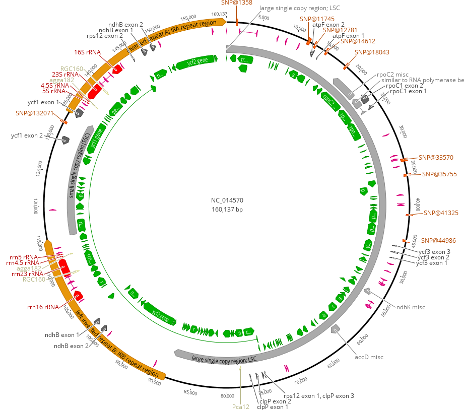

<!---pjbiggs.github.io--->

# Bioinformatics practical for 2019 SING-Aotearoa session

This is taking place on Wednesday 23rd January 2019 in C5-10, Science Tower C, Massey University, Palmerston North.

## What are we going to do?

Following on from this morning's work, we are going to look at how short sequence reads generated by Illumina technology can be mapped to a reference genome -- in this case a chloroplast genome from a related tree (*Eucalyptus grandis*) -- to look for SNPs that can locate the samples to geographical locations.  Your task is to find out where the 5 samples come from.  

We will go into this into certain aspects of this in a little more detail later, but the chloroplast we are looking at is ~160kb in length, and a genomic map of this chloroplast is shown below.

Clicking on the link [NC_014570](https://www.ncbi.nlm.nih.gov/nuccore/NC_014570) will take you to the entry at NCBI which you can have a look at. 

We have our reference genome, and also our short reads that we are going to do two things with: map these to the reference and assemble the short reads into longer sequence contigs.

## Overview of the session

We are planning on covering the following in our 90 minute session:

* Mapping
    * Fastq format
    * SAM/BAM files
    * Visualisation of mapping
    * What did we learn?
* Assembly
    * Brief theory
    * Attempt with these reads (or a subset) – tbd 
    * What did we learn?
---

## Mapping of reads to a reference genome

### Fastq format

A brief overview of the format can be found at [FASTQ_format](https://en.wikipedia.org/wiki/FASTQ_format). Please have a look at this file to familairse yourself with the fact that each sequence covers 4 lines of text, and has much more information in it than a standard fasta file:

> read header (usually starts with '@')
>
> sequence
>
> extra line (now usually a "+") for space reasons
>
> quality (encoded as a single character defined by an equation)

This is in comparison to a much simpler fasta file:

> read header (starts with '>')
>
> sequence

For the purposes of today, we want to encode a quality value called *Q* -- **how confident we are that the base is called as being incorrect** -- as a probability *p*.  As you can imagine this is an issue as a value of *p* will have more than 1 character, but it refers to a single base, be that A, C, G or T.  Therefore, how do we do this?  We use an equation to relate *p* to *Q* thus:

$$
Q_{sanger} = -10log_{10}p
$$

Many pieces of software are able to automatically determine the encoding system used (yes, there is more than one, sigh), so they can convert between the two.  This has implications for the mapping of short reads to a reference genome using mapping software such as [Bowtie2](http://bowtie-bio.sourceforge.net/bowtie2/index.shtml) or [BWA](http://bio-bwa.sourceforge.net/), but first we have to lok at our main file type, an "industry standard" if you like.

### SAM/BAM files

### Visualisation of mapping

### What did we learn?

---

## Assembling a small genome 

### Brief theory

### Attempt with these reads (or a subset) – tbd 

### What did we learn?

So, let's get going in R:

`library(ggplot2)`

